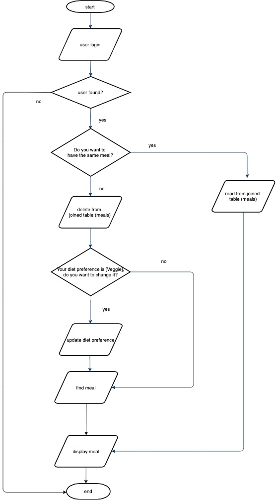

# Module One Final Project: CLI Random Meal Generator.

#Austin Cohort 2019 User Guidelines

* As a user, I want to be able to enter my first name. 
* As a user, I want to be able to update my dietary preference to either vegetarian or non-vegetarian.
* As a user, I should be able to retrieve my last saved meal with the name, cost per serving, and ingredient list.
* As a user, I want to be able to generate another random meal based on dietary preference. This will delete my old meal and 
 save the meal I choose, then exit out of CLI application.  

### TECHNICAL OBJECTIVES

1. Access a Sqlite3 Database using ActiveRecord.
2. You should have at minimum three models including one join model. This means you must have a many-to-many relationship.
3. You should seed your database using data that you collect either from an API.
4. Your models should have methods that answer interesting questions about the data. See flowchart.
5. You should provide a CLI to display the return values of your interesting methods.  
6. Use good OO design patterns. You should have separate classes for your models and CLI interface.

  **Resource:** [RECIPE API](https://spoonacular.com/food-api)
  
  ### SET UP FOR CLI APPLICATION 
  
1.) Make sure Ruby installed by opening your terminal and typing:

ruby -v

2.) It should return this:

ruby 2.6.1p33 (2019-01-30 revision 66950) [x86_64-darwin18]

If you don't have ruby installed, you'll have to get that up and running in your machine first. You can do that by going to the Official Ruby Language Downloads page and following the instructions to download and install ruby on your computer.

3.) Download this repository.

4.) Run this command in your terminal:

bundle install

5.) To open application type this command in your terminal:
cd bin

ruby run.rb

5.) It will then prompt you to enter your first name.  See flowchart if need further instructions. 

Bon Appétit!

